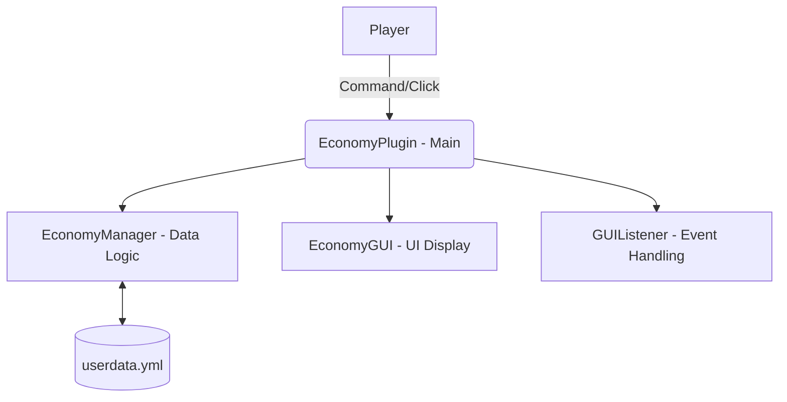

# [프로젝트 보고서] 마인크래프트 경제 시스템 및 GUI 플러그인 개발

**과목명:** 프로젝트 기반 자바 프로그래밍 (또는 해당 과목명)  
**개발자:** 허진  
**개발 기간:** 2026.05.07  
**주요 기술:** Java 17, Paper API, Maven, Bukkit API

---

## 1. 프로젝트 개요
본 프로젝트는 마인크래프트 서버(Paper) 내에서 플레이어 간의 경제 활동을 지원하는 **경제 시스템 플러그인**을 개발하는 것을 목표로 합니다. 단순히 채팅 명령어로만 작동하는 것이 아니라, GUI(Graphical User Interface)를 통해 사용자 친화적인 경험을 제공하도록 설계되었습니다.

## 2. 주요 기능
- **데이터 영속성 (Persistence):** 플레이어의 돈 데이터를 YAML 파일(`userdata.yml`)에 저장하여 서버 재시작 시에도 정보가 유지됨.
- **경제 명령어:** `/돈`, `/보내기` 등 한글 명령어를 지원하며, 특히 `/돈 확인` 명령어로 즉시 잔액을 확인할 수 있음.
- **GUI 인터페이스:** 상자(Inventory) 형태의 UI를 통해 자신의 잔액을 시각적으로 확인 가능 (천 단위 콤마 표기 적용).
- **예외 처리:** 송금 시 잔액 부족, 존재하지 않는 플레이어 입력 등에 대한 방어 코드 구현.

## 3. 기술 스택 및 개발 환경
- **언어:** Java 17
- **빌드 도구:** Apache Maven (의존성 관리 및 빌드 자동화)
- **API:** Paper API (성능 최적화된 마인크래프트 서버 API)
- **IDE:** IntelliJ IDEA
- **버전 관리:** Git / GitHub

## 4. 시스템 구조 (Architecture)



- **EconomyManager:** 비즈니스 로직과 데이터 입출력을 담당.
- **EconomyGUI:** 플레이어에게 보여줄 인벤토리 레이아웃 정의.
- **GUIListener:** GUI 내부의 클릭 이벤트를 감지하고 아이템 탈취를 방지.

## 5. 핵심 구현 내용

### 5.1 데이터 관리 로직 (`EconomyManager.java`)
`YamlConfiguration`을 활용하여 플레이어의 UUID를 키값으로 잔액을 관리합니다.
```java
public void saveData() {
    for (Map.Entry<UUID, Double> entry : balances.entrySet()) {
        dataConfig.set("balances." + entry.getKey().toString(), entry.getValue());
    }
    dataConfig.save(dataFile);
}
```

### 5.2 GUI 구현 (`EconomyGUI.java`)
플레이어에게 잔액을 보여주는 핵심 UI 코드입니다.
```java
Inventory inv = Bukkit.createInventory(null, 27, GUI_NAME);
ItemStack balanceItem = new ItemStack(Material.GOLD_INGOT);
// ... 메타데이터 및 로어 설정
inv.setItem(13, balanceItem); // 중앙 배치
```

## 6. 기대 효과 및 향후 발전 방향
본 프로젝트를 통해 자바의 객체 지향 프로그래밍과 데이터 파일 입출력, 이벤트 리스너 구조를 실습할 수 있었습니다. 향후에는 실제 게임 내 아이템을 사고팔 수 있는 **상점 GUI** 기능과 **데이터베이스(MySQL) 연동**을 통해 대규모 서버에서도 안정적으로 작동하도록 확장할 계획입니다.

## 7. 결론
Paper API와 자바를 활용하여 안정적이고 직관적인 마인크래프트 경제 시스템을 성공적으로 구현하였습니다. 특히 GUI와 한글 명령어 지원을 통해 사용자 경험을 크게 향상시켰습니다.
